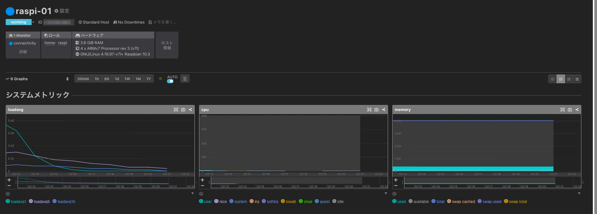
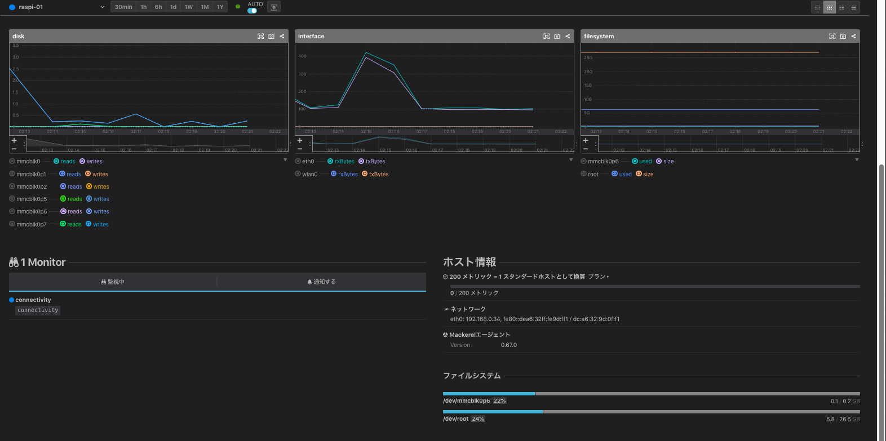

# mackerel-agent-raspi (install to RaspberryPi 4)
a Ansible Role

## What's this ?
- Raspberry Pi (4) に mackerel-agent をインストールしてモニタリングを行うべく  
  簡素にセットアップしたくて適当に作成した Ansible Role .

## Prerequirement
- 対象の Raspberry Pi 機種
    - SSH接続設定

## Usage
- Get and Set `mackerel-agent-raspi`
    - ex) 
        ```
        git clone https://github.com/sogaoh/AnsiblePractice.git
        cd AnsiblePractice/roles
        mv mackerel-agent-raspi ${your_properly_roles_directory}/
        cd ../..
        rm -rf AnsiblePractice
        ```
- Prepare playbook (Sample is below:)
    ```
    - hosts: all
      become: yes

      roles:
        - mackerel-agent-raspi
    ```
- Prepare variables.yaml (on same place as playbook)
    ```
    mackerel_agent_apikey: <YOUR_API_KEY>
    ```
- Run playbook
    - ex) `ansible-playbook ./my-raspi.yaml -i "[target host IP, etc...],"  -e @variables.yaml --ask-become-pass -vv -C`


## Assumed Result


