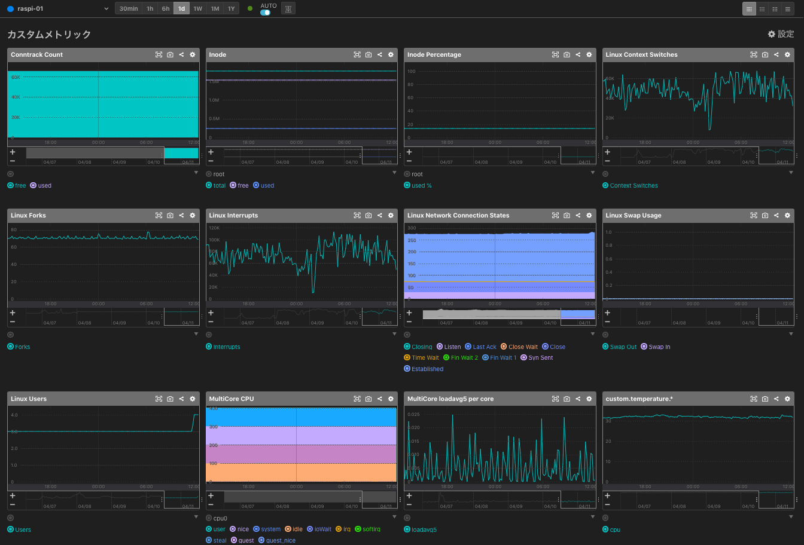
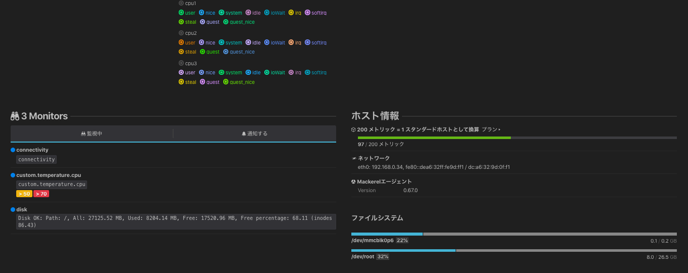

# mackerel-plugins-raspi (install to RaspberryPi 4)
a Ansible Role


## What's this ?
- Raspberry Pi (4) で Mackerel を利用したモニタリングを行うべく  
  plugins を簡素にセットアップしたくて適当に作成した Ansible Role .


## Prerequirement
- 対象の Raspberry Pi 機種
    - SSH接続設定
    - golang のインストール 
        - /usr/local/go/bin/go が利用可能

## Usage
- Get and Set `mackerel-plugins-raspi`
    - ex) 
        ```
        git clone https://github.com/sogaoh/mackerel-practice.git
        cd mackerel-practice/roles
        mv mackerel-plugins-raspi ${your_properly_roles_directory}/
        cd ../..
        rm -rf mackerel-practice
        ```
- Prepare playbook (Sample is below:)
    ```
    - hosts: all
      become: yes

      roles:
        #- mackerel-agent-raspi
        #- golang-raspi
        - mackerel-plugins-raspi
    ```
- Run playbook
    - ex) `ansible-playbook ./my-raspi.yaml -i "[target host IP, etc...]," -vv -C`


## Assumed Result

