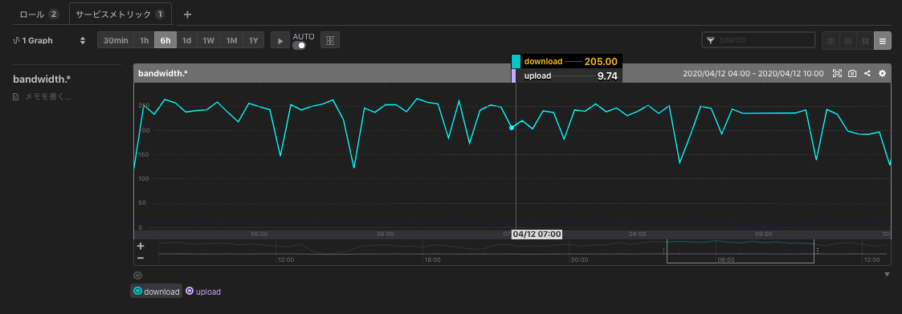
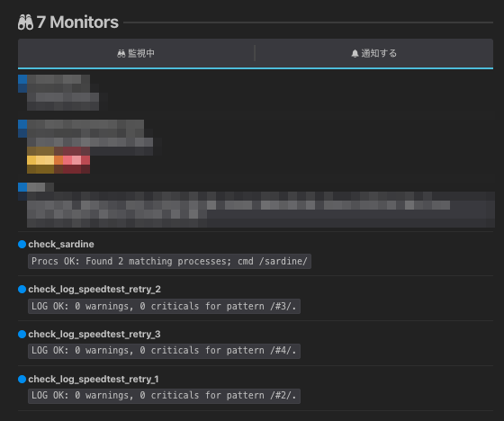

# sardine_service-raspi (install to RaspberryPi 4)
a Ansible Role

## What's this ?
- Raspberry Pi (4) に sardine を Serivce 登録してモニタリングを行うべく  
  簡素にセットアップしたくて適当に作成した Ansible Role .

## Prerequirement
- 対象の Raspberry Pi 機種
    - SSH接続設定
    - mackerel-agent のインストール
    - golang のインストール 
        - /usr/local/go/bin/go が利用可能
    - mackerel-plugins のインストール
        - mackerel-agent-plugins
        - **go-check-plugins** (for プロセス監視, ログ監視)
    - speedtest_net-cli のインストール
    - [sardine](https://github.com/fujiwara/sardine) のインストール
        - git clone -> cd sardine -> make install

## Usage
- Get and Set `sardine_service-raspi`
    - ex) 
        ```
        git clone https://github.com/sogaoh/mackerel-practice.git
        cd mackerel-practice/roles
        mv sardine_service-raspi ${your_properly_roles_directory}/
        cd ../..
        rm -rf mackerel-practice
        ```
- Prepare playbook (Sample is below:)
    ```
    - hosts: all
      become: yes

      roles:
        #- mackerel-agent-raspi
        ##- golang-raspi
        #- mackerel-plugins-raspi
        #- speedtest_net-cli-raspi
        ##- sardine-raspi
        - sardine_service-raspi  
    ```
- Prepare variables.yaml (on same place as playbook)
    ```
    mackerel_agent_apikey: <YOUR_API_KEY>
    service_to_post: <YOUR_SERVICE>
    ```
- Run playbook
    - ex) `ansible-playbook ./my-raspi.yaml -i "[target host IP, etc...],"  -e @variables.yaml -vv -C`


## Assumed Result


